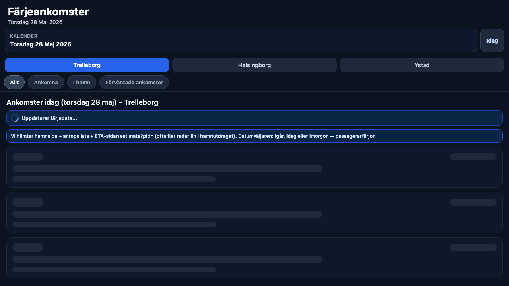

# Färjeankomster Sverige

Expo/React Native app (web + mobile) for passenger ferry arrivals in Swedish ports.

## Demo

- Live: [ferry-arrivals-sweden-elli.netlify.app](https://ferry-arrivals-sweden-elli.netlify.app/)

## Screenshot



## Tech

- Expo 54 + React Native + TypeScript
- React Native Web for browser delivery
- Public source ingestion from MyShipTracking pages
- Text-proxy strategy via `r.jina.ai` to avoid browser CORS blockers
- Domain parsing + merge logic for arrivals, in-port, and expected feeds

## Outcome

- Gives a single, easy-to-read arrival view across Ystad, Trelleborg, and Helsingborg.
- Handles noisy real-world source data with deduplication between ETA and confirmed arrivals.
- Provides practical status visibility (arrived/scheduled/delayed) without paid AIS API keys.

## Local Development

```bash
npm install
npm run web
```

## Run on Device

```bash
npm run start
```

